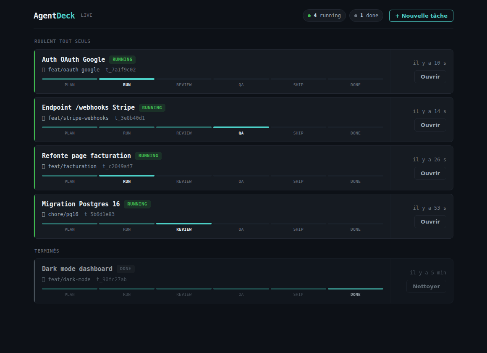
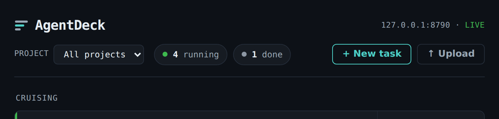

# AgentDeck

Self-hosted, **gstack-native** orchestrator for running multiple Claude Code agents in parallel on a VPS. An air-traffic-control board for your agents: one glance tells you which agent needs you, which is cruising, which broke.

`1 task = 1 branch = 1 git worktree = 1 agent.` Strict isolation, no sharing. Agents run on the server, so they keep going when you close your laptop or drop the SSH connection.

<p align="center">
  
</p>

<p align="center"><sub>One agent flips to <code>waiting</code>, you answer in the drawer, and it resumes — live over WebSocket.</sub></p>

> Status: **v0.2.5.1** — early but working end to end. The full loop runs with a real agent: create a task → branch → git worktree → the agent runs → it asks a question in prose → you reply from the dashboard → `claude --resume` continues → done, with the artifact on disk. Ships as a single self-contained binary (see **Install**). Not yet production-hardened.

## Why this and not Claude Squad / Conductor / amux

Those orchestrate agents generically. AgentDeck is coupled to the **gstack workflow**: it *drives* each agent through the `Plan → Run → Review → QA → Ship → Done` pipeline, one turn per step, and the board shows where each one is because the daemon is the thing that put it there. The human-in-loop moment is a first-class feature. Narrow on purpose — built for people who already run Claude Code + gstack.

## How it works

```
                     ┌──────────────────────────────────────────────┐
   Browser ──WS──────┼─▶ AgentDeck daemon (Bun, systemd, non-root)    │
   Slack/Telegram ◀──┼── notification-only (reply in the dashboard)   │
                     │   Agent supervisor: N × headless Claude Code    │
                     │   State store (SQLite, keyed by sessionId)      │
                     └───▲──────────────────────────────▲──────────────┘
                         │ HTTP hooks / SDK stream       │
              ┌──────────┴───┐                    ┌──────┴───────┐
              │ Agent 1       │  ...               │ Agent N      │
              │ cwd=worktree-1│                    │ cwd=worktree-N│
              └───────────────┘                    └──────────────┘
                 git worktree                         git worktree
```

**The human-in-loop mechanic (proven):** in headless mode Claude Code has no AskUserQuestion tool, so the agent asks in **prose** and the turn ends. AgentDeck reads the question, notifies you (Slack/Telegram), and when you reply in the dashboard it injects the answer as a new `claude --resume <sessionId>` turn. That same `resume` is also how agents survive a daemon restart — injection and durability are one operation.

**A daemon restart is not an outage.** Rebuilding or restarting drops every open
dashboard's WebSocket. The board says so in three distinct states rather than
freezing on stale data, and it recovers on its own — no page reload, because the
dashboard token is persisted across restarts.

<p align="center">
  
</p>

**How "waiting" is detected:** a headless agent can't interrupt mid-turn — under `claude -p`, Claude Code's `Notification` hook doesn't fire (only `Stop` does, which is redundant with the turn-end `result` event). So when a turn ends, the daemon reads the `result` and decides waiting-vs-done from the prose. The prose heuristic is the signal.

The `Notification`-hook wiring still ships but is **off by default** (`AGENTDECK_HOOKS=true`). The HTTP hook transport works; `Notification` is simply inert under `claude -p`, and it's kept ready for a future interactive / SDK (`query()` + Channels) mode where it would fire.

## Install with Claude Code (recommended)

Run this **in a Claude Code session on the machine where AgentDeck should live** (your VPS, not your laptop). Claude Code has shell access — paste the prompt and it installs gstack (if it's missing), downloads AgentDeck, asks for your target repo, and sets up a systemd service. It checks first whether gstack is already installed, is idempotent, and stops with a clear message if anything's off.

**It never installs a daemon that runs as root.** If you're root, it creates a dedicated unprivileged account and a system unit for it — because Claude Code refuses `--dangerously-skip-permissions` under uid 0, so a root daemon fails every task at spawn, in milliseconds.

<details>
<summary><b>📋 Copy this prompt into Claude Code →</b></summary>

```text
Install AgentDeck (a self-hosted orchestrator for parallel Claude Code agents) and gstack (its required workflow toolkit) on THIS machine. Be idempotent, print each step, and STOP with a clear message if a prerequisite is missing or a check fails. Use absolute paths — do not assume PATH changes persist between your shell commands.

0. PREFLIGHT — decide WHICH ACCOUNT runs the daemon. This is the first decision, not a detail.
- Detect OS/arch: `uname -s` / `uname -m`. Confirm `git` is present.
- Run `id -u` and pick the mode:
    not 0                -> MODE = SELF.      The daemon runs as me, under `systemd --user`.
                            RUN_USER=$USER, RUN_HOME=$HOME.
    0 and uname -s=Linux -> MODE = DEDICATED. Create an unprivileged service account and a SYSTEM unit.
                            RUN_USER=agentdeck, RUN_HOME=/var/lib/agentdeck.
    0 and not Linux      -> STOP. There is no `useradd`/systemd here; tell me to re-run as an unprivileged user.
- Tell me the mode and WHY, in one line: Claude Code refuses `--dangerously-skip-permissions` under uid 0, so a daemon running as root fails every task at spawn — a root install is not something this runbook produces.
- RUN-AS CONVENTION (DEDICATED mode). Every step below that says "as RUN_USER" means exactly this shape:
    su -s /bin/bash agentdeck -c "export HOME=/var/lib/agentdeck PATH=/usr/local/bin:/usr/bin:/bin:/var/lib/agentdeck/.local/bin; <command>"
  Do NOT drop the `HOME=` or the `PATH=`, and do not assume either is inherited:
    * `su` without `-` keeps ROOT's HOME, so a `curl | bash` installer happily writes into /root and then fails on permissions;
    * a non-interactive shell never sources `.bashrc`, so `~/.local/bin` is not on PATH unless you put it there.
  The account's shell is `nologin` on purpose — `su -s /bin/bash` still works, and that is the only way in.
  In SELF mode, "as RUN_USER" just means: run it normally.
- TOOLCHAIN — for RUN_USER. In DEDICATED mode the account does not exist yet, so do this right after 0b, not now; just tell me what is missing.
    * `bun` — install it AS RUN_USER (`curl -fsSL https://bun.sh/install | bash`, with `BUN_INSTALL=$RUN_HOME/.bun` in DEDICATED mode), then symlink BOTH `bun` and `bunx` into `$RUN_HOME/.local/bin`. gstack's setup calls `bunx`, so a `bun`-only link fails it halfway through.
    * `node` — gstack's setup uses it to install Playwright's Chromium. Without it, gstack still installs and every plan/review/ship skill works, but `/browse` and `/qa` do not. Say which of the two you ended up with.
    * `claude` (Claude Code) — installed AND authenticated for RUN_USER. Not for you, for RUN_USER: the daemon spawns `claude` as itself at runtime. In DEDICATED mode that is step 2 below.

0b. DEDICATED MODE ONLY — create the service account
- Get the script (from a clone: `scripts/setup-agent-user.sh`; or download it):
    curl -fsSL https://raw.githubusercontent.com/Corenthin-Buffard/AgentDeck/main/scripts/setup-agent-user.sh -o /tmp/setup-agent-user.sh && chmod +x /tmp/setup-agent-user.sh
- Run it: `sudo /tmp/setup-agent-user.sh --user agentdeck --home /var/lib/agentdeck`
  It creates the account, its directories, `/etc/systemd/system/agentdeck.service`, and reloads systemd. It deliberately does NOT enable or start anything — the daemon cannot work before credentials and a repo, and a service that boots into failure is exactly what this whole install avoids.
- It is idempotent: re-running it is safe and changes nothing that already exists.

1. GSTACK — for RUN_USER (not for you)
- Check: `[ -f "$RUN_HOME/.claude/skills/gstack/VERSION" ] && echo "gstack INSTALLED $(cat ...)" || echo "gstack NOT INSTALLED"`
- If INSTALLED: print the version, do NOT reinstall (I can run `/gstack-upgrade` later). Continue.
- If `$RUN_HOME/.claude/skills/gstack` exists but has NO `VERSION` file: broken/partial install — STOP and ask me to inspect/remove it (do not clone over it).
- If NOT installed, AS RUN_USER:
    git clone --single-branch --depth 1 https://github.com/garrytan/gstack.git "$RUN_HOME/.claude/skills/gstack"
    cd "$RUN_HOME/.claude/skills/gstack" && GSTACK_SKIP_FONTS=1 ./setup --no-prefix --no-plan-tune-hooks --quiet
  In DEDICATED mode do NOT symlink my own `~/.claude/skills/gstack` into the service account: it would depend on `/root` staying traversable, and my next gstack upgrade would move what the link points at. Give it its own clone.
- Verify: `VERSION` exists AND `bin/gstack-config get telemetry` succeeds, both AS RUN_USER.
- NOTE on testing skill resolution later: gstack skills only resolve inside a REAL git workspace. Checking from a bare directory like `/tmp` gives a false negative — test from the target repo.

2. CLAUDE CODE — for RUN_USER (DEDICATED mode)
- Install `claude` under $RUN_HOME as RUN_USER and make sure it resolves on the service PATH ($RUN_HOME/.local/bin). Do NOT point a symlink at my own installation: it depends on `/root` being traversable, and root's auto-update will move the target out from under it.
- CREDENTIALS — STOP, my decision. Present both, pick neither:
    (a) `claude login` as RUN_USER — its own session, durable. I have to do the device flow myself.
        Give it the PATH, per the RUN-AS convention, or you get `claude: command not found`:
          su -s /bin/bash agentdeck -c 'HOME=/var/lib/agentdeck PATH=/usr/local/bin:/usr/bin:/bin:/var/lib/agentdeck/.local/bin claude login'
    (b) copy my `~/.claude/.credentials.json` to $RUN_HOME/.claude/.credentials.json (chown to RUN_USER, mode 0600).
  Immediate, and it ROTS: the OAuth refresh token rotates, so the copy keeps working only until MY
  session refreshes, after which every agent fails at authentication. Measured here — the copy was
  dead within hours, and `--check` reported the file as present the whole time. Treat (b) as a
  stopgap, and re-run `--check` (it validates the expiry, not just the file) before trusting it.
  Without WORKING credentials, agents fail at authentication rather than at spawn — and today the
  daemon marks such a task `done` rather than `error`, so it fails green. That is the worst-looking
  failure mode there is, which is why the witness task at the end is not optional.

3. AGENTDECK — download the binary from Releases
- Pick the asset for this platform: Linux x86_64 -> agentdeck-linux-x64 ; Linux aarch64/arm64 -> agentdeck-linux-arm64 ; macOS arm64 -> agentdeck-darwin-arm64 ; anything else (Windows, Intel Mac) -> build from source (below).
- Install it to `/usr/local/bin/agentdeck` in DEDICATED mode (the service no longer runs as the account that installed it), or `$HOME/.local/bin/agentdeck` in SELF mode:
    curl -fsSL "https://github.com/Corenthin-Buffard/AgentDeck/releases/latest/download/<ASSET>" -o <TARGET>
    chmod +x <TARGET>
- VALIDATE the download before continuing: `file <TARGET>` must report an executable (ELF/Mach-O) and the file must be > 1 MB. If not (e.g. a 404 HTML page saved as the binary), STOP with a clear message.
- Source fallback (no prebuilt binary for this platform): clone into a fresh dir (if `~/AgentDeck` already exists, `git -C ~/AgentDeck pull` instead of cloning), then `bun install && bun run build`, then `install -m 755 dist/agentdeck <TARGET>`.

4. THE TARGET REPO — STOP, my decision
- Ask me for AGENTDECK_TARGET_REPO — the ABSOLUTE path of the git repo the agents will work on. VALIDATE it is a git repo: `git -C "<path>" rev-parse --git-dir` — if not, STOP and ask me again.
- In DEDICATED mode, RUN_USER must be able to write it. Present both options, pick neither:
    (a) share the existing repo: `chown -R agentdeck: <repo>` — and then ALSO run `git config --global --add safe.directory <repo>` for every other user who still works in it, or git answers them `fatal: detected dubious ownership` and I will think you broke my repo;
    (b) clone it somewhere neutral (e.g. /srv/<project>) owned by RUN_USER, leaving my copy untouched.
- Then verify access and traversal SEPARATELY — they fail for different reasons and need different fixes:
    su -s /bin/bash agentdeck -c 'test -w <repo>/.git'          # can it write the repo?
    su -s /bin/bash agentdeck -c 'test -x <parent-of-repo>'     # can it even reach it? /root at 0700 kills this
  If the parent is not traversable, STOP and offer option (b) rather than opening up my home directory.

5. CONFIG
- Optionally ask for notifications: AGENTDECK_SLACK_WEBHOOK, or AGENTDECK_TG_TOKEN + AGENTDECK_TG_CHAT.
- Write `$RUN_HOME/.config/agentdeck/env` in systemd EnvironmentFile format (one KEY=VALUE per line, no quoting/shell expansion; warn me if a value contains spaces, `%` or `#`). Include: AGENTDECK_HOST=127.0.0.1, AGENTDECK_PORT=8787, AGENTDECK_TARGET_REPO=<path>, and any notification vars. In DEDICATED mode the setup script has already seeded this file — edit it, keep it owned by RUN_USER, mode 0600.
- Do NOT set AGENTDECK_ALLOW_ROOT. It exists for a machine where no service account can be created, and this install has one.

6. GIT IDENTITY FOR THE AGENT — STOP, my action
- SSH: generate a DEDICATED key as RUN_USER (`ssh-keygen -t ed25519 -C "agentdeck@$(hostname)"`), print the public key, and tell me to add it as a **deploy key with write access** on the repos the agents will push to. Do not copy my own account key onto the box: it grants write access to EVERY repo I can touch, not just this one.
- `gh`: the agent needs it installed AND authenticated, or it does the whole task and then fails at `/ship` — and AgentDeck's auto-clean, which proves a merge via `gh`, can never prove anything. Authenticate as RUN_USER (`gh auth login`, or a GH_TOKEN in the env file).

7. PERSISTENCE
- DEDICATED mode: the unit is already written. GATE FIRST — `sudo /tmp/setup-agent-user.sh --user agentdeck --home /var/lib/agentdeck --check`. It exits 0 (good), 2 (the daemon will run but a flagged part of the workflow will not), or 1 (broken — do NOT start it; fix what it lists and re-run). Read the output back to me. Then: `systemctl enable --now agentdeck`.
- SELF mode: first check `systemctl --user show-environment` works (needs a user bus / XDG_RUNTIME_DIR). If it fails (bare VPS SSH session, minimal container) -> SKIP systemd, run AgentDeck in the background with the env file, and tell me plainly that persistence is NOT set up. Otherwise write `$HOME/.config/systemd/user/agentdeck.service` with REAL newlines, one directive per line:
    [Unit]
    Description=AgentDeck daemon
    After=default.target
    [Service]
    ExecStart=%h/.local/bin/agentdeck
    EnvironmentFile=%h/.config/agentdeck/env
    Environment=PATH=<paste the CURRENT interactive $PATH here>:%h/.local/bin:%h/.bun/bin
    Restart=on-failure
    RestartPreventExitStatus=78
    [Install]
    WantedBy=default.target
  Then `loginctl enable-linger "$USER"` so it survives logout/reboot (may need root — if it fails, warn me that the service won't survive a full logout; do not claim it's persistent when it isn't), and `systemctl --user daemon-reload && systemctl --user enable --now agentdeck`.
- BOTH modes, CRITICAL: the service PATH must include wherever `claude` lives, or the daemon starts but CANNOT spawn agents. Confirm `command -v claude` resolves within that exact PATH, as RUN_USER, BEFORE enabling.
- `RestartPreventExitStatus=78` matters: exit 78 means an unrecoverable config error (currently: the port is already bound). Without it, `Restart=on-failure` retries forever against a port that will still be busy.

8. VERIFY — with `GET /api/health`, NOT by grepping the page title. A misconfigured daemon serves a perfectly good dashboard while every task dies; "the page loads" is not evidence that anything works.
    systemctl [--user] is-active agentdeck        # must be: active
    curl -s http://127.0.0.1:8787/api/health      # must report "ok": true
- If `ok` is `false`, ask the daemon WHY — the diagnostic half is token-gated, because it reports the daemon's uid and the paths it reads. The token lives in RUN_HOME, so in DEDICATED mode it is not in my home directory:
    TOKEN=$(cat "$RUN_HOME/.agentdeck/dashboard-token")     # DEDICATED: read it as root, or via su -s /bin/bash agentdeck
    curl -s -H "x-agentdeck-token: $TOKEN" http://127.0.0.1:8787/api/health
  The `notices` array says exactly what is wrong and what to do — read it back to me and STOP. Do NOT report a successful install. Also confirm `uid` in that response is NOT 0. If port 8787 is already in use, the service exits 78 with a one-line reason (I can set a different AGENTDECK_PORT).
- WITNESS TASK — the real acceptance test. Create one task on the target repo asking the agent to: print `id -u`, list its `plan-*` skills, and run the project's test command. It must return a non-zero uid, all five plan skills, and a real test result. A daemon that boots proves nothing; this proves identity, skills and toolchain at once.

9. DONE — summarize: mode (SELF/DEDICATED) and WHICH USER the daemon runs as, gstack version, agentdeck path, service status, `/api/health` ok + uid + any notices, what `--check` reported, whether `claude` resolves in the service PATH, what the witness task returned, and whether the deploy key still needs to be added on GitHub.
- Dashboard: http://127.0.0.1:8787 (localhost-bound). From my laptop I reach it via `ssh -L 8787:127.0.0.1:8787 user@vps` then http://localhost:8787.
```

</details>

Prereqs on the box: `git`, plus `claude` (authenticated) and gstack **for the account the daemon runs as** — which, if you install as root, is the service account the prompt creates, not you. `bun`, `bunx` and `node` are needed by gstack's own setup (and by the source-build fallback). Not on Linux with systemd? The prompt still installs everything and runs the daemon — it just tells you persistence isn't wired up (set up `launchd`/a process manager yourself).

## Install manually (binary)

Grab the single binary for your platform from [Releases](https://github.com/Corenthin-Buffard/AgentDeck/releases/latest) — the dashboard is embedded, so it's self-contained (no runtime, no `node_modules`, no sibling files):

```bash
# Linux x64 (swap the suffix for -linux-arm64 or -darwin-arm64)
curl -fsSL https://github.com/Corenthin-Buffard/AgentDeck/releases/latest/download/agentdeck-linux-x64 -o agentdeck
chmod +x agentdeck
AGENTDECK_TARGET_REPO=/path/to/your/project ./agentdeck
# → http://127.0.0.1:8787  (bind is localhost — reach it via an SSH tunnel)
```

On the box it drives you still need `claude` (Claude Code) on PATH and authenticated, plus gstack for the phase tracking — the binary bundles AgentDeck, not the agents it runs.

Run it under systemd to survive your laptop closing (that's the whole point — the daemon keeps the agents going while you're away): a `--user` unit if you install as yourself, a system unit under a dedicated account if you're root. **Don't run it as root** — Claude Code refuses `--dangerously-skip-permissions` at uid 0 and every task dies at spawn; see [Don't run the daemon as root](#dont-run-the-daemon-as-root).

## Run from source

Prereqs: [Bun](https://bun.sh), `claude` (Claude Code) on PATH and authenticated, and gstack for the phase tracking.

```bash
bun install   # (no deps yet, but conventional)
AGENTDECK_TARGET_REPO=/path/to/your/project \
AGENTDECK_TG_TOKEN=... AGENTDECK_TG_CHAT=... \
bun run daemon
# → http://127.0.0.1:8787  (bind is localhost — reach it via an SSH tunnel)

bun run build     # → dist/agentdeck, the same self-contained binary CI ships
```

Config knobs (env): `AGENTDECK_HOST` (default `127.0.0.1`), `AGENTDECK_PORT` (`8787`), `AGENTDECK_TARGET_REPO` (default: cwd — seeds the `default` project when there's no `projects.json`), `AGENTDECK_DATA_DIR` (default `~/.agentdeck` — SQLite DB + worktrees + uploads + `projects.json`), `AGENTDECK_WORKTREES`, `AGENTDECK_UPLOADS` (default `<dataDir>/uploads`), `AGENTDECK_MAX_AGENTS` (`4`), `AGENTDECK_PIPELINE` (off — ticks the gstack-pipeline box by default on new tasks; see [The gstack pipeline](#the-gstack-pipeline)), `AGENTDECK_CLAUDE_BIN` (`claude`), `AGENTDECK_REVIEW_READ_BIN` (gstack-review-read; resolved from PATH — the `[plan-reviews]` boot notice names it when missing), `AGENTDECK_SKIP_PERMISSIONS` (default on — `--dangerously-skip-permissions`; set `false` to disable), `AGENTDECK_PERMISSION_MODE` (`acceptEdits`, used only when skip is off), `AGENTDECK_CLAUDE_ARGS`, `AGENTDECK_ALLOWED_HOSTS` (comma-separated Hosts accepted besides loopback — needed behind a reverse proxy, see [Upload files to the VPS](#upload-files-to-the-vps)), `AGENTDECK_AUTO_CLEAN_MERGED` (off; `true` periodically drops a done task's worktree, branch and row once its branch is merged), `AGENTDECK_HOOKS` (opt-in Notification hooks, off by default), `AGENTDECK_HOOK_BASE_URL`, `AGENTDECK_HOOK_TOKEN` (per-session secret agents use for hooks), `AGENTDECK_DASHBOARD_TOKEN` (per-session secret the browser uses for writes/uploads — injected into the served HTML), `AGENTDECK_TG_TOKEN`/`AGENTDECK_TG_CHAT`, `AGENTDECK_SLACK_WEBHOOK`.

`AGENTDECK_ALLOW_ROOT` exists too, and is deliberately not in that list: it is an escape hatch for a machine where no service account can be created, not a configuration choice — see [Don't run the daemon as root](#dont-run-the-daemon-as-root).

## The gstack pipeline

Tick **Follow the gstack pipeline** on a new task and the daemon runs it as a
sequence, one `claude -p` turn per step:

| # | phase | step |
|---|-------|------|
| 1 | plan | `/spec` — turn the request into an executable spec |
| 2 | plan | `/autoplan` — CEO, design, eng and DX plan reviews, auto-decided |
| 3 | run | implement the approved plan |
| 4 | review | `/review` the diff |
| 5 | qa | `/qa`, and fix what it finds |
| 6 | ship | `/ship` — commit, push, open the PR |
| 7 | ship | `/canary` |

**The daemon drives it; the agent is not merely asked to.** That distinction is the
whole design. A turn ends when the model stops, and AgentDeck reads a quiet result
as `done` — so an agent *instructed* to follow a sequence would be marked complete
the moment it finished step 1 and wrote a summary. Because the daemon issues each
step, `phase` is something it knows rather than infers.

Each step runs in a **fresh session**. Seven heavy skills in one context would
compact, and a compacted agent that loses the thread just ends its turn. Steps hand
off through gstack's own artifacts instead — the spec file, `*-reviews.jsonl`, the
test plan.

A question **does not** advance the step: answering resumes that step's session, so
the step you were asked about is the one that finishes. A turn that *fails* (API
error, abort) retries, bounded per step. A step that *runs* and reports it cannot
proceed stops the task — it will not go better the second time.

**`/ship` is told not to bump `VERSION` or edit `CHANGELOG.md`.** Every agent works
in its own worktree, so there is no concurrent write; the collision is a *merge*
conflict when the second PR lands, which no amount of scheduling prevents. Removing
the per-task bump removes the conflict — you bump once, at merge.

Leave the box unticked for a free-form task: the agent gets your instructions
verbatim and the phase bar is inferred from activity, exactly as before. The board
distinguishes the three cases — driven, free-form (muted, dashed), and *commanded
but nothing happened* (amber, "pipeline did not run"), which is what you see if a
step finishes without invoking the skill it was told to.

Off by default while it earns its baseline: set `AGENTDECK_PIPELINE=true` to tick
the box by default. Override the step table by dropping a `pipeline-steps.md` in the
data dir — one step per paragraph, `<phase> [/skill]` on the first line, the
instruction beneath. It is read lazily and every problem degrades to the built-in
table with a notice on the dashboard, including one that names a skill the board
cannot track.

## Launch requirement

For gstack's skills to resolve and run inside a headless agent, agents must be started with **`--dangerously-skip-permissions`** — `--permission-mode acceptEdits` isn't enough. AgentDeck sets this by default. Each agent is confined to its own git worktree on your own box, so the blast radius is that one task's branch; set `AGENTDECK_SKIP_PERMISSIONS=false` only for a supervised, hands-on debugging run.

### Don't run the daemon as root

**Claude Code refuses `--dangerously-skip-permissions` under uid 0.** A daemon running as root therefore fails every task in milliseconds, at spawn. AgentDeck detects this at boot: it logs an error, shows a red banner on the dashboard, reports `ok: false` from `GET /api/health`, and refuses to create new tasks rather than leaving you a trail of dead worktrees.

The fix is to run the daemon as an unprivileged user. Two supported shapes, depending on who you are when you install:

- **Installing as yourself** → a `systemd --user` unit plus `loginctl enable-linger`. Your account already has `claude`, gstack and credentials.
- **Installing as root** → a dedicated service account and a **system** unit with `User=`. [`scripts/setup-agent-user.sh`](scripts/setup-agent-user.sh) creates the account, its directories and the unit; the [install runbook](#install-with-claude-code-recommended) covers the parts that are decisions rather than commands — credentials, repo access, the deploy key. Run `--check` before you start the service: it audits what the *agent* needs (`claude`, credentials, gstack, `git`, an authenticated `gh`) as the service user, on the service PATH.

If it genuinely must run as root — no way to create a service account — `AGENTDECK_ALLOW_ROOT=true` makes agents carry `IS_SANDBOX=1`, which lifts Claude Code's root guard, and tasks run normally with gstack intact. It is a last resort, not the other half of a choice. Understand what you are trading:

- **The worktree argument above stops holding.** An agent running as root with permissions skipped can rewrite the systemd unit, read `~/.agentdeck/dashboard-token` and `agent-settings.json` (both `0600`, both readable by root), and touch every registered project. The blast radius is the box, not one branch.
- **`IS_SANDBOX` is an undocumented Claude Code internal**, not a supported flag, and it does more than lift the root guard. A future release can remove it. AgentDeck watches for that: if a task dies on the root refusal while `AGENTDECK_ALLOW_ROOT` is set, the banner is replaced with an error saying the escape hatch is gone, rather than continuing to claim it works.

### Migrating an existing root install

If you already run the daemon as root (with or without `AGENTDECK_ALLOW_ROOT`), this moves it onto a service account. The order matters more than any single step.

> **Drain first.** Let every in-flight task finish, and migrate only when nothing is `running` or `resuming`. Claude Code stores its transcripts under the daemon's `$HOME`, in a directory derived from each agent's cwd — so changing `HOME` makes every stored `sessionId` unresolvable. `claude --resume` then finds nothing, and the A2 durability that normally survives a restart loses those tasks **silently**.

1. `systemctl --user stop agentdeck && systemctl --user disable agentdeck` — before touching the SQLite file.
2. Create the account and give it what it needs: `sudo scripts/setup-agent-user.sh`, then `claude`, gstack and credentials for it (runbook steps 0b–2).
3. Move the data dir, so the database, worktrees and task rows come along. Step 2 already created an empty `/var/lib/agentdeck/.agentdeck`, and `mv` onto an existing directory would nest yours *inside* it — leaving the daemon with an empty database and every task apparently gone. Remove the empty one first; `rmdir` refuses if it isn't empty, which is the guard you want:
   ```
   rmdir /var/lib/agentdeck/.agentdeck
   mv ~/.agentdeck /var/lib/agentdeck/.agentdeck && chown -R agentdeck: /var/lib/agentdeck/.agentdeck
   ```
4. Give it the target repo (runbook step 4) — **including `git config --global --add safe.directory <repo>` for yourself**, or your own `git` starts refusing the repo you just handed over.
5. Write the new env file **without** `AGENTDECK_ALLOW_ROOT`; it has no reason to exist anymore.
6. `sudo scripts/setup-agent-user.sh --check`, then `systemctl daemon-reload && systemctl enable --now agentdeck`.
7. Archive the old `--user` unit instead of deleting it — a rollback is cheap while you still have it.
8. Verify: `/api/health` must report `uid` = the new account's, and an empty `notices`.

## Multiple projects (one daemon, many repos)

One daemon can drive several repos. Drop a **`projects.json`** in the data dir
(`~/.agentdeck` by default):

```json
[
  { "id": "api", "path": "/srv/billing-api", "label": "Billing API" },
  { "id": "web", "path": "/srv/web" }
]
```

`id` is the routing key, `path` is the repo, `label` is what the dashboard shows
(defaults to the folder name). The header **Project** switcher filters the board
to one project or shows *All projects* (with a per-row tag); the choice is
remembered across reloads. Each task's branch/worktree lands in its project's
repo. Bad entries are skipped at boot with a warning; if there's no
`projects.json`, a single `default` project is synthesized from
`AGENTDECK_TARGET_REPO` — so existing single-repo setups keep working unchanged.

## Upload files to the VPS

The dashboard's **Upload** button sends a local file to the box (no more manual
`scp`): it lands under `<dataDir>/uploads/<project>/` and the toast gives you the
absolute VPS path to reference in a task (with a copy button). Uploads — and every
other state-changing request (create/stop/delete/reply) — are gated by a
dashboard token (persisted 0600 in the data dir, injected into the served HTML,
sent as a header, so a cross-origin page can't forge them) and path-contained:
capped at 25 MB, filename sanitized, symlinked directories rejected, no writing
outside the target dir. The **live WebSocket is gated on the same token** (sent as
a subprotocol, never in the URL) plus an `Origin` check: WebSockets are not covered
by the same-origin policy, so without that gate any page you had open could read
the board. **Every route** — reads included — is also gated on a recognised `Host`
header: a hostile page whose domain resolves to `127.0.0.1` (DNS rebinding) reaches
the daemon from your own browser, and the reads are what it would harvest. Loopback
names are accepted on any port, so an `ssh -L 9000:127.0.0.1:8787` tunnel works
unchanged. Behind a reverse proxy, set `AGENTDECK_ALLOWED_HOSTS` to the hostname
your proxy sends, or the daemon rejects everything and says so at boot.

## QA with authenticated cookies on the VPS

The agent's browser on the VPS starts logged out, and gstack's cookie **capture**
is local-only (it decrypts your real Chrome via the OS keychain, impossible on a
headless server). But cookie **consumption** is portable, so:

1. **Locally**, log in once and save the state:
   `/setup-browser-cookies` (or a scripted login) → `$B state save qa` writes
   `.gstack/browse-states/qa.json` (a plain array of Playwright cookies).
2. **Upload** that JSON with the **Upload** button, ticking *QA browse-state* —
   it's placed at your project repo's `.gstack/browse-states/qa.json`.
3. **In the QA task**, the agent runs `$B state load qa` before the
   authenticated steps.

Alternative for a repeatable QA: a dedicated test account + scripted login, so
there are no cookies to transfer at all.

## Layout

```
src/        daemon: config, types, db (SQLite/WAL), git (worktrees), phase,
            agent (supervisor), notify, tasks, bus, server, daemon
public/     Master Inbox dashboard (live over WebSocket)
```

## License

[MIT](LICENSE) © 2026 Corenthin Buffard
